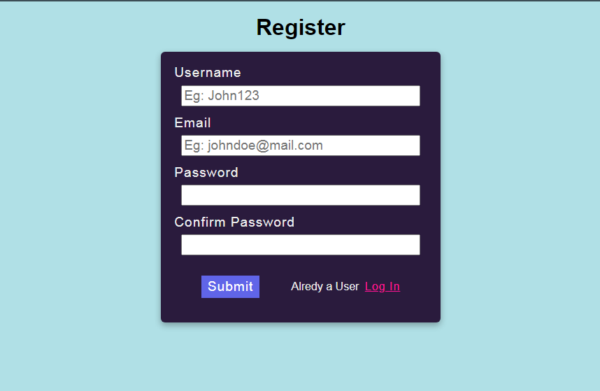
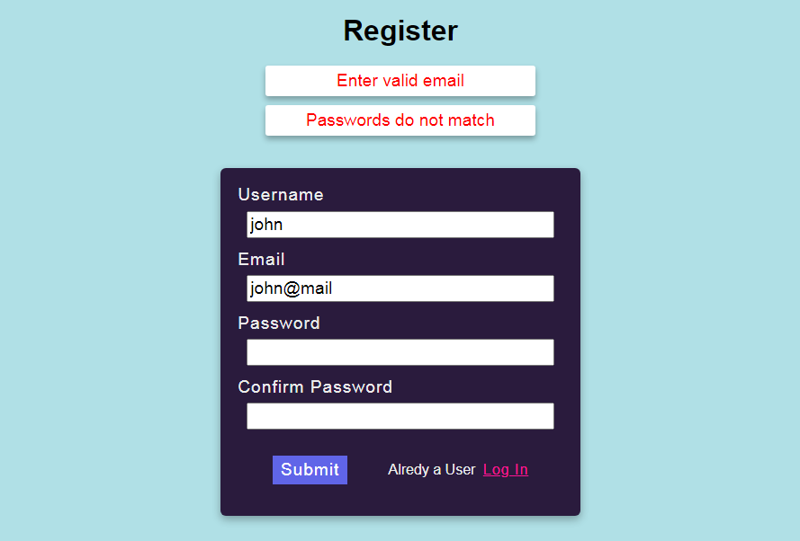
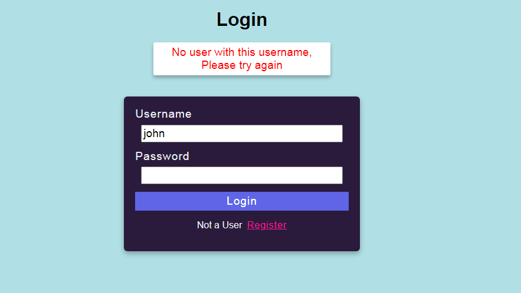
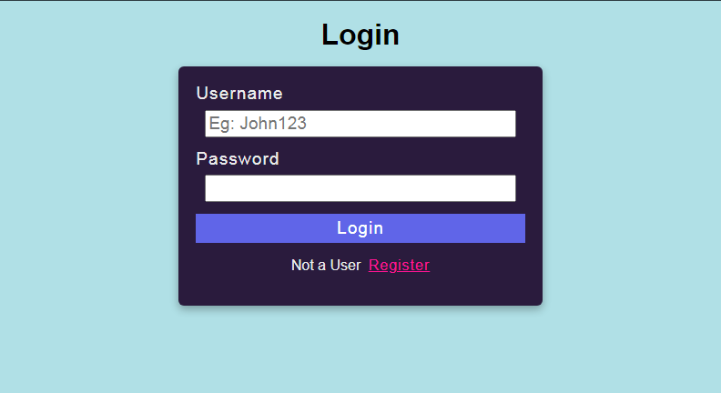

# PHP Registration and Login

## Uses:

	htmlspecialchars($var)` while outputting data
	
	mysqli_real_escape_string($conn, $_POST['var']) to escape special characters
	
	password_hash($password, PASSWORD_DEFAULT) and
	password_verify($password, $hashed_password)
	to hash and store passwords in database
	
	$_SESSION['vars'] to authenticate a user 
	
## Registration Page

## Errors
	

## Login Page

## Home Page

